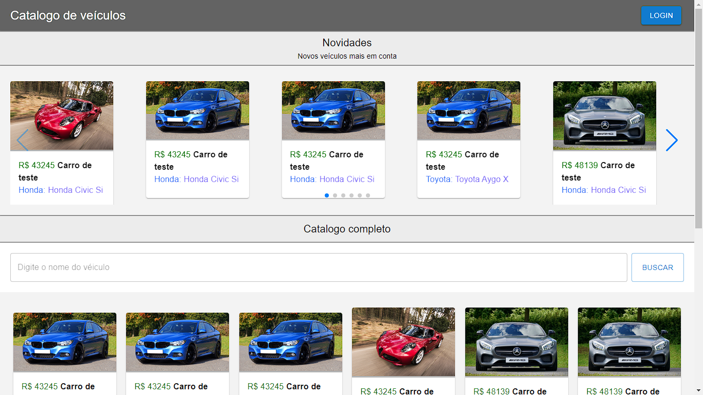
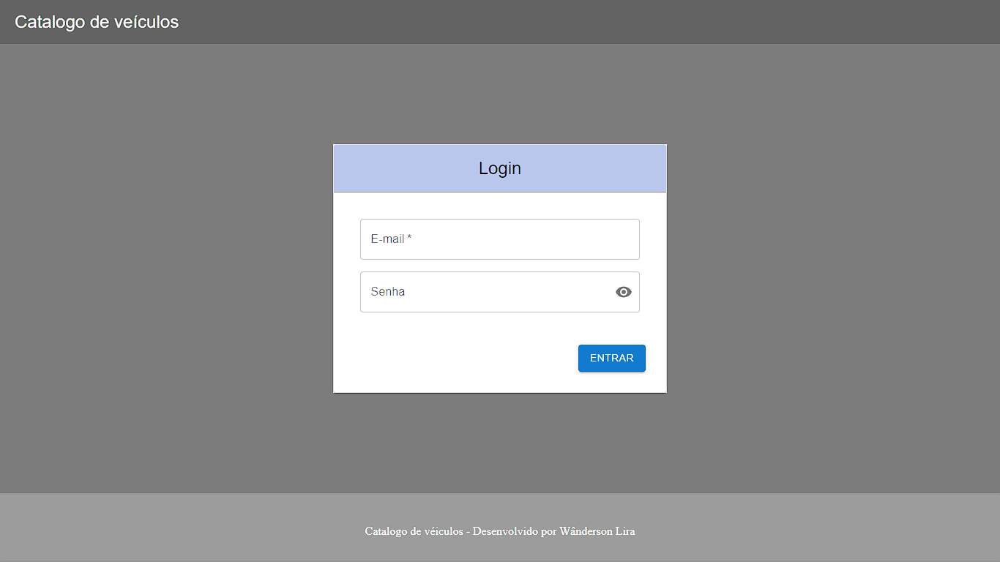
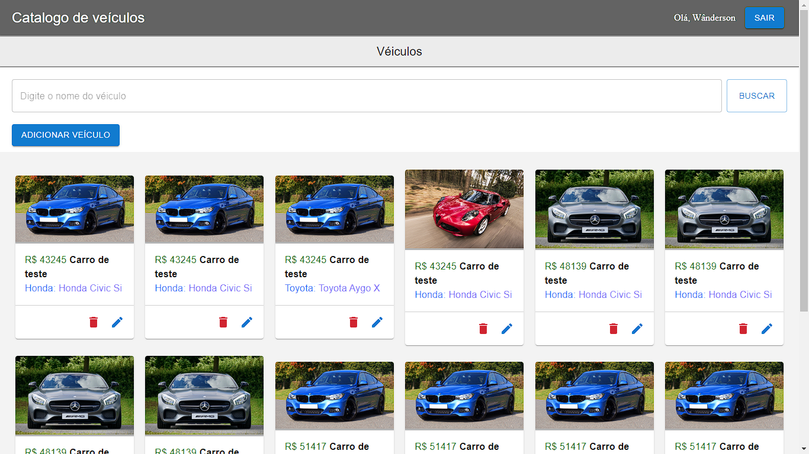
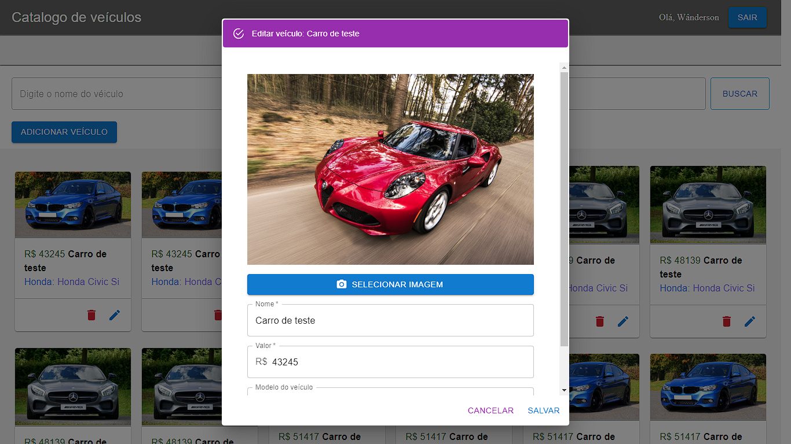
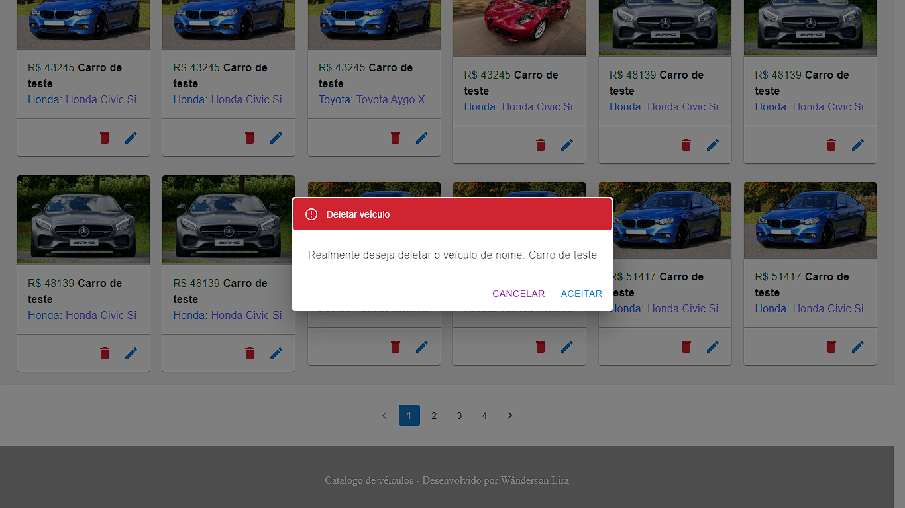

# _Catalogo de veículos_
Neste projeto foi construído um catalogo de veículos. O site conta com uma página inicial que é dividida em dois grupos: novidades e catalogo. A listagem de novidades conta com uma lista de veículos cadastrados mais recentemente com menor valor. Já o catalogo complete possibilita a busca de veículos por nome e navegação através de paginação. É possível também autenticar-se para cadastrar, editar e excluir veículos no sistema.

## Documentação


Protótipo no figma - https://www.figma.com/file/R81X0fEy0YEEwFPKiXMFtD/Vehicle-catalog?node-id=5503%3A6951

## Principais tecnologias utilizadas
- Docker
- Banco de dados Mysql versão 8
- Back-end
    - Nodejs versão 16
    - Typescript
    - API Rest com expressjs
    - QueryBuilder Knexjs
    - Atenticação por JWT
    - Encriptação/decriptação de senha com bcrypt
- Front-end
    - React
    - Vitejs
    - Scss

## Instalação
Para fins de praticidade o volume do banco de dado do docker  e arquivos de média estão juntos do repositório para que todos os dados de teste estejam disponíveis.
### Passo 1
Clone este repositório localmente
### Passo 2
Caso não tenha o docker e npm faça a instalação através dos seguintes links:
- Docker: https://docs.docker.com/get-docker/
- npm: https://nodejs.org/en/download/
### Passo 3
Vá até a pasta que o projeto foi clonado e abra o cmd e execute os seguintes comandos:
> Obs. O Processo de instalação pode demorar alguns minutos
```sh
cd .\vehicle_catalog_api\api
npm install
cd ..\..\vehicle_catalog_front\
npm install
cd ..\
docker compose up -d --build 
cd .\vehicle_catalog_front
npm run dev
````
Após esses comandos o site estará rodando na seguinte link http://localhost:8080/ o back-end no http://localhost:3000/


## Interfaces
A seguir algumas telas da aplicação e instruções de uso. Para se autenticar utilize os seguinte dados de acesso:
```
email: wanderson100v@gmail.com
senha: 1234
```
### Home page


### Login


### Tela inicial do painel admistrativo


### Model Para persistir veículo: cadastrar/editar


### Model Para exclusão de veículo
